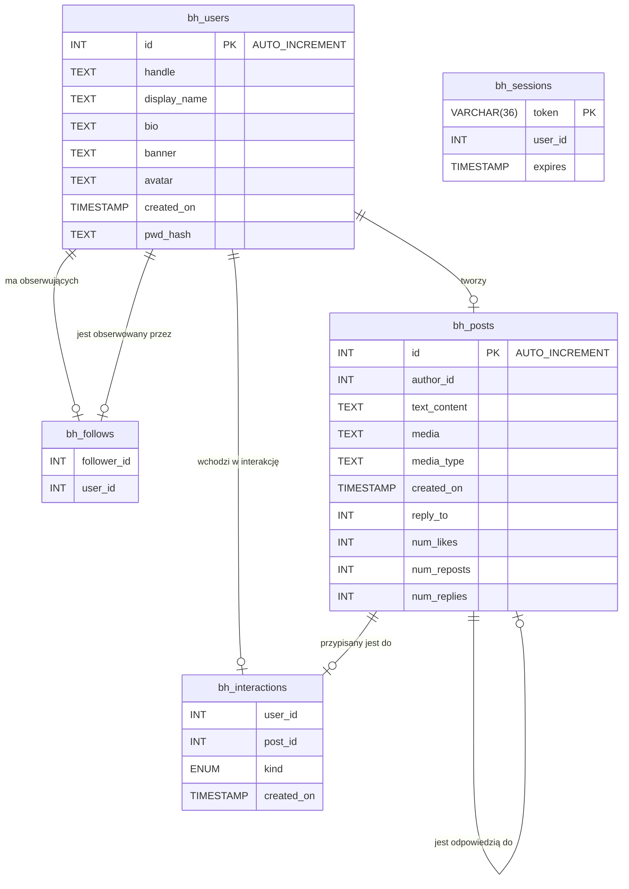

# Schemat bazy danych Birdhouse
Następujący diagram opisuje schemat bazy danych Birdhouse.

```mermaid
erDiagram
    bh_users {
        INT id PK "AUTO_INCREMENT"
        TEXT handle
        TEXT display_name
        TEXT bio
        TEXT banner
        TEXT avatar
        TIMESTAMP created_on
        TEXT pwd_hash
    }
    
    bh_follows {
        INT follower_id
        INT user_id
    }
    
    bh_posts {
        INT id PK "AUTO_INCREMENT"
        INT author_id
        TEXT text_content
        TEXT media
        TEXT media_type
        TIMESTAMP created_on
        INT reply_to
        INT num_likes
        INT num_reposts
        INT num_replies
    }
    
    bh_interactions {
        INT user_id
        INT post_id
        ENUM kind
        TIMESTAMP created_on
    }
    
    bh_sessions {
        VARCHAR(36) token PK
        INT user_id
        TIMESTAMP expires
    }

    bh_users ||--o| bh_follows : "ma obserwujących"
    bh_users ||--o| bh_follows : "jest obserwowany przez"
    bh_users ||--o| bh_posts : "tworzy"
    bh_users ||--o| bh_interactions : "wchodzi w interakcję"
    bh_posts ||--o| bh_interactions : "przypisany jest do"
    bh_posts ||--o| bh_posts : "jest odpowiedzią do"
```